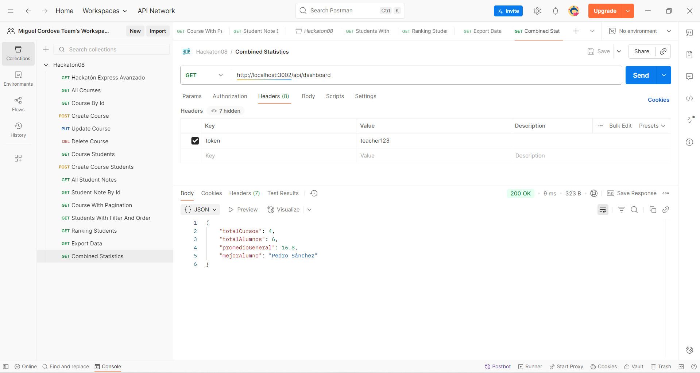

# API REST con Express

> Entrega final — API lista

## Estructura del proyecto
```
SV72007284/
├─ src/
│ ├─ controllers/
│ │ ├─ course.controller.js
│ │ ├─ dashboard.controller.js
│ │ ├─ export.controller.js
│ │ └─ student.controller.js
│ ├─ data/
│ │ └─ data.json
│ ├─ img/
│ │ └─ endPoints.png
│ ├─ middlewares/
│ │ ├─ auth.middleware.js
│ │ ├─ permissions.middleware.js
│ │ └─ validateName.middleware.js
│ ├─ router/
│ │ ├─ courses.js
│ │ ├─ dashboard.js
│ │ ├─ export.js
│ │ ├─ index.js
│ │ └─ students.js
│ └─ index.js
├─ package.json
└─ README.md
```
---
## Estructura de data.json
```
{
  "profesores": [
    {
      "id": 1,
      "nombre": "Dr. Juan Martínez",
      "especialidad": "Programación"
    },
    {
      "id": 2,
      "nombre": "Ing. Laura Fernández",
      "especialidad": "Bases de Datos"
    },
    {
      "id": 3,
      "nombre": "MSc. Roberto Díaz",
      "especialidad": "Redes y Comunicaciones"
    }
  ],
  "alumnos": [
    {
      "id": 1,
      "nombre": "Carlos Pérez",
      "nota": 18
    },
    {
      "id": 2,
      "nombre": "Ana Gómez",
      "nota": 15
    },
    {
      "id": 3,
      "nombre": "Luis Torres",
      "nota": 19
    },
    {
      "id": 4,
      "nombre": "María Rodríguez",
      "nota": 12
    },
    {
      "id": 5,
      "nombre": "Jorge Castillo",
      "nota": 17
    },
    {
      "id": 6,
      "nombre": "Pedro Sánchez",
      "nota": 20
    }
  ],
  "courses": [
    {
      "id": 1,
      "name": "Introducción a la Programación",
      "descripcion": "Curso básico de programación en distintos lenguajes.",
      "alumnosIds": [
        1,
        2,
        3,
        4
      ],
      "profesorId": 1,
      "creditos": 4
    },
    {
      "id": 2,
      "name": "Bases de Datos Avanzadas",
      "descripcion": "Estudio de modelos de datos, normalización y SQL avanzado.",
      "alumnosIds": [
        3,
        4,
        5
      ],
      "profesorId": 2,
      "creditos": 5
    },
    {
      "id": 3,
      "name": "Redes y Comunicaciones",
      "descripcion": "Principios de redes de computadoras, protocolos y seguridad.",
      "alumnosIds": [
        6
      ],
      "profesorId": 3,
      "creditos": 3
    },
    {
      "id": 4,
      "name": "JavaScript Avanzado",
      "descripcion": "Profundización en conceptos de programación con JavaScript.",
      "alumnosIds": [
        2,
        4,
        6
      ],
      "profesorId": 1,
      "creditos": 5
    }
  ]
}
```
---
## Variables de entorno
- **PORT** — puerto donde correr la API (por defecto 3002)

## Ejecutar
> npm run dev

## Token y roles
Se usan tokens falsos en el header checkRole y token:
- **teacher123** - role: teacher (permiso completo)
- **student123** - role: student (permiso limitado)
---
## Endpoints


- **GET** - /api/courses
- **GET** - /api/courses/1
- **POST** - /api/courses
body:
```
{
    "id": 4,
    "name": "JavaScript Avanzado",
    "descripcion": "Profundización en conceptos de programación con JavaScript.",
    "alumnosIds": [2, 4, 6],
    "profesorId": 1,
    "creditos": 5
}
```
- **PUT** - /api/courses/4
body:
```
{
    "name": "JavaScript Avanzado II",
    "descripcion": "Profundización en conceptos de programación con JavaScript.",
    "alumnosIds": [2, 4, 6],
    "profesorId": 1,
    "creditos": 5
}
```
- **DELETE** - /api/courses/4
- **GET** - /api/courses/1/students
- **POST** - /api/courses/1/students
body:
```
{
  "alumnosIds": [3, 4]
}
```
- **GET** - /api/students
- **GET** - /api/students/1
- **GET** - /api/courses/paginated?page=1&limit=2
```
{
    "page": 1,
    "limit": 2,
    "total": 4,
    "data": [
        {
            "id": 1,
            "name": "Introducción a la Programación",
            "descripcion": "Curso básico de programación en distintos lenguajes.",
            "alumnosIds": [
                1,
                2,
                3,
                4
            ],
            "profesorId": 1,
            "creditos": 4
        },
        {
            "id": 2,
            "name": "Bases de Datos Avanzadas",
            "descripcion": "Estudio de modelos de datos, normalización y SQL avanzado.",
            "alumnosIds": [
                3,
                4,
                5
            ],
            "profesorId": 2,
            "creditos": 5
        }
    ]
}
```
- **GET** - /api/students?minNota=15&sort=desc
```
[
    {
        "id": 6,
        "nombre": "Pedro Sánchez",
        "nota": 20
    },
    {
        "id": 3,
        "nombre": "Luis Torres",
        "nota": 19
    },
    {
        "id": 1,
        "nombre": "Carlos Pérez",
        "nota": 18
    },
    {
        "id": 5,
        "nombre": "Jorge Castillo",
        "nota": 17
    },
    {
        "id": 2,
        "nombre": "Ana Gómez",
        "nota": 15
    }
]
```
- **GET** - /api/students/ranking
```
[
    {
        "id": 6,
        "nombre": "Pedro Sánchez",
        "nota": 20,
        "posicion": 1
    },
    {
        "id": 3,
        "nombre": "Luis Torres",
        "nota": 19,
        "posicion": 2
    },
    {
        "id": 1,
        "nombre": "Carlos Pérez",
        "nota": 18,
        "posicion": 3
    },
    {
        "id": 5,
        "nombre": "Jorge Castillo",
        "nota": 17,
        "posicion": 4
    },
    {
        "id": 2,
        "nombre": "Ana Gómez",
        "nota": 15,
        "posicion": 5
    },
    {
        "id": 4,
        "nombre": "María Rodríguez",
        "nota": 12,
        "posicion": 6
    }
]
```
- **GET** - /api/export
- **GET** - /api/dashboard
```
{
    "totalCursos": 4,
    "totalAlumnos": 6,
    "promedioGeneral": 16.8,
    "mejorAlumno": "Pedro Sánchez"
}
```
---

**Autor:** *(Alexander Córdova)*  
**Hackaton08:** API REST con Express